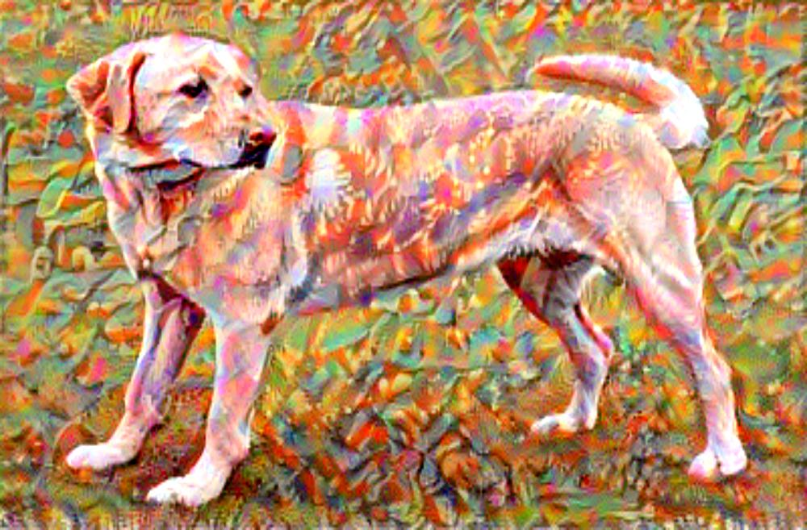

# This is the implementation of the paper "A Neural Algorithm of Artistic Style"

## The paper can be found in: https://arxiv.org/abs/1508.06576

## Results
These are the results of the implementation of the paper. The results are not as good as the paper but they are good enough to show the working of the algorithm. The results can be improved by using a better optimizer and by training the model for more epochs. 

Result generated by training the model for 5000 epochs.
### Content Image

### Style Image

### Generated Image

Other results are generated by training the model for 1000 epochs.
### Content Image

### Style Image

### Generated Image

### Content Image

### Style Image

### Generated Image

